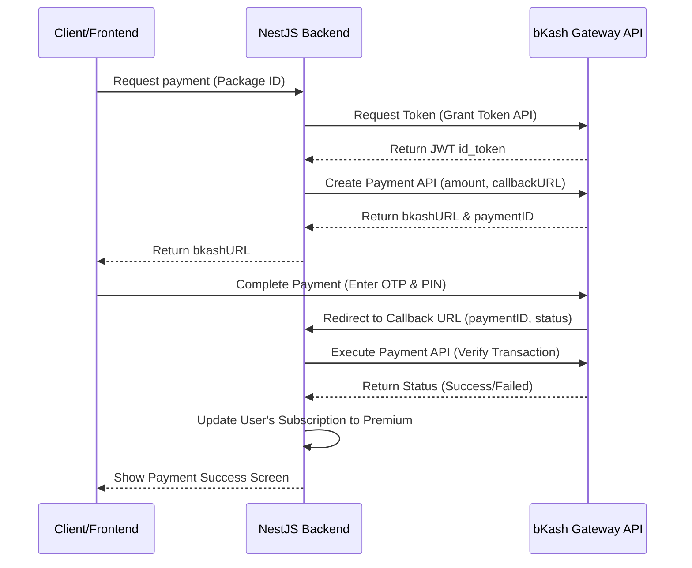

# API Rate Limiting, Manual Payment, and bKash Integration Guide

এই গাইডটিতে আপনার **Keeper POS (NestJS + MongoDB)** প্রজেক্টে **API Rate Limiting**, **Super Admin ও Role-based Approval System**, **Subscription Packages**, এবং **Free Tier Limitations** (১টি কাস্টমার, ১টি ম্যানেজার, ৫টি ইনভেন্টরি আইটেম ও ৫টি সেলস লিমিট) কীভাবে ধাপে ধাপে কোডসহ ইমপ্লিমেন্ট করবেন তা বিস্তারিত তুলে ধরা হলো।

---

## সূচিপত্র (Table of Contents)
1. [API Rate Limiting (এপিআই রেট লিমিটিং)](#১-api-rate-limiting-এপিআই-রেট-লিমিটিং)
2. [Role-based Admin System (সুপার অ্যাডমিন ও এপ্রুভাল সিস্টেম)](#২-role-based-admin-system-সুপার-অ্যাডমিন-ও-এপ্রুভাল-সিস্টেম)
3. [Subscription Packages & Manual Payment Flow (প্যাকেজ ও পেমেন্ট ফ্লো)](#৩-subscription-packages-manual-payment-flow-প্যাকেজ-ও-পেমেন্ট-ফ্লো)
4. [bKash Payment Integration (বিকাশ পেমেন্ট ইন্টিগ্রেশন)](#৪-bkash-payment-integration-বিকাশ-পেমেন্ট-ইন্টিগ্রেশন)
5. [Free Tier Feature Limitations (ফ্রি টিয়ার লিমিটেশন লজিক)](#৫-free-tier-feature-limitations-ফ্রি-টিয়ার-লিমিটেশন-লজিক)

---

## ১. API Rate Limiting (এপিআই রেট লিমিটিং)

এপিআই সিকিউরিটি এবং ডস (DoS) অ্যাটাক প্রতিরোধের জন্য রেট লিমিট অ্যাড করা প্রয়োজন।

### ধাপ ১: প্যাকেজ ইনস্টল
```bash
npm i --save @nestjs/throttler
```

### ধাপ ২: গ্লোবাল কনফিগারেশন (`src/app.module.ts`)
```typescript
import { Module } from '@nestjs/common';
import { ThrottlerModule, ThrottlerGuard } from '@nestjs/throttler';
import { APP_GUARD } from '@nestjs/core';
// ... অন্যান্য imports

@Module({
  imports: [
    // ... অন্যান্য modules
    ThrottlerModule.forRoot([{
      ttl: 60000, // ১ মিনিট
      limit: 20,  // প্রতি মিনিটে সর্বোচ্চ ২০টি রিকোয়েস্ট (আপনার পছন্দমতো পরিবর্তন করতে পারেন)
    }]),
  ],
  providers: [
    {
      provide: APP_GUARD,
      useClass: ThrottlerGuard,
    },
  ],
})
export class AppModule {}
```

---

## ২. Role-based Admin System (সুপার অ্যাডমিন ও এপ্রুভাল সিস্টেম)

**প্রশ্ন:** পেমেন্ট অনুমোদন করার অ্যাডমিন অ্যাকাউন্টটি কীভাবে তৈরি হবে? এটি কি সুপার অ্যাডমিন হবে নাকি শুধু একটি এপিআই?

**সমাধান:** সবচেয়ে ভালো প্র্যাকটিস হলো আপনার সিস্টেমে `superadmin` রোল চালু করা। 
- **admin:** ইনি হচ্ছেন দোকানের মালিক (Shop Owner), যিনি তার ম্যানেজার ও বেচাকেনা নিয়ন্ত্রণ করেন।
- **superadmin:** ইনি হচ্ছেন প্ল্যাটফর্মের মালিক (Platform Owner/You), যিনি পেন্ডিং পেমেন্টগুলো দেখে এপ্রুভ বা রিজেক্ট করতে পারবেন।

### ধাপ ১: User Schema আপডেট (`src/modules/auth/schemas/user.schema.ts`)
রোল এনিয়ামে `superadmin` যোগ করুন এবং সাবস্ক্রিপশন ট্র্যাকিং ফিল্ডগুলো যুক্ত করুন:

```typescript
// src/modules/auth/schemas/user.schema.ts
@Prop({ required: true, enum: ['superadmin', 'admin', 'manager'], default: 'admin' })
role: string;

@Prop({ required: true, enum: ['free', 'basic', 'premium'], default: 'free' })
subscriptionTier: string;

@Prop({ type: Date, default: null })
subscriptionExpiresAt: Date;
```

### ধাপ ২: Roles Guard তৈরি করা (`src/common/guards/roles.guard.ts`)
নিশ্চিত করতে হবে যে শুধুমাত্র `superadmin` রোলধারী ব্যবহারকারীই এপ্রুভাল এপিআই কল করতে পারছেন।

```typescript
// src/common/guards/roles.guard.ts
import { Injectable, CanActivate, ExecutionContext, ForbiddenException } from '@nestjs/common';
import { Reflector } from '@nestjs/core';

@Injectable()
export class RolesGuard implements CanActivate {
  constructor(private reflector: Reflector) {}

  canActivate(context: ExecutionContext): boolean {
    const requiredRoles = this.reflector.get<string[]>('roles', context.getHandler());
    if (!requiredRoles) return true;

    const request = context.switchToHttp().getRequest();
    const user = request.user; // JwtAuthGuard থেকে আসা ইউজার অবজেক্ট

    if (!user || !requiredRoles.includes(user.role)) {
      throw new ForbiddenException('You do not have permission to access this resource');
    }
    return true;
  }
}
```

---

## ৩. Subscription Packages & Manual Payment Flow (প্যাকেজ ও পেমেন্ট ফ্লো)

### প্যাকেজ দেখানোর নিয়ম (How to show packages)
প্যাকেজগুলো ডাটাবেজে স্টোর করতে পারেন অথবা ব্যাকএন্ডে একটি স্ট্যাটিক এন্ডপয়েন্ট রাখতে পারেন যা ফ্রন্টএন্ডে শো করবে।

#### স্ট্যাটিক প্যাকেজ ডেটা এপিআই:
`GET /api/subscriptions/packages`
```typescript
@Get('packages')
getPackages() {
  return [
    {
      id: 'free',
      name: 'Free Starter',
      price: 0,
      limits: { customers: 1, managers: 1, items: 5, sales: 5 },
      durationDays: 'Lifetime'
    },
    {
      id: 'premium',
      name: 'Premium POS Pro',
      price: 1500, // BDT
      limits: { customers: 'unlimited', managers: 'unlimited', items: 'unlimited', sales: 'unlimited' },
      durationDays: 30
    }
  ];
}
```

### ম্যানুয়াল সাবস্ক্রিপশন পেমেন্ট ফ্লো
১. ইউজার একটি পেইড প্যাকেজ সিলেক্ট করবেন।
২. বিকাশ বা ব্যাংকের মাধ্যমে আপনার দেওয়া নাম্বারে টাকা পাঠিয়ে **Transaction ID (TrxID)** এবং **Package ID** দিয়ে রিকোয়েস্ট সাবমিট করবেন।
৩. ডাটাবেজে এটি `status: 'pending'` হিসেবে জমা হবে।
৪. `superadmin` ড্যাশবোর্ডে গিয়ে পেমেন্ট স্ট্যাটাস `approved` করে দেবেন। এপ্রুভ হওয়ার সাথে সাথে ইউজারের `subscriptionTier` পরিবর্তন হয়ে `premium` হবে এবং মেয়াদ ৩০ দিন বাড়িয়ে দেওয়া হবে।

#### Subscription Schema (`src/modules/subscriptions/schemas/subscription-payment.schema.ts`):
```typescript
@Schema({ timestamps: true })
export class SubscriptionPayment {
  @Prop({ required: true, type: MongooseSchema.Types.ObjectId, ref: 'User' })
  userId: string;

  @Prop({ required: true })
  packageId: string; // 'basic', 'premium'

  @Prop({ required: true })
  amount: number;

  @Prop({ required: true })
  paymentMethod: string; // 'bkash_manual', 'bank'

  @Prop({ required: true, unique: true })
  transactionId: string;

  @Prop({ default: 'pending', enum: ['pending', 'approved', 'rejected'] })
  status: string;

  @Prop({ default: null })
  rejectionReason: string;
}
```

#### Approval Endpoint in Controller (`superadmin` দ্বারা নিয়ন্ত্রিত):
```typescript
// Controller-এ এপ্রুভাল এন্ডপয়েন্ট
@UseGuards(JwtAuthGuard, RolesGuard)
@SetMetadata('roles', ['superadmin']) // শুধুমাত্র superadmin এক্সেস পাবেন
@Patch('approve/:paymentId')
async approveSubscription(@Param('paymentId') paymentId: string, @GetUser() superAdmin: any) {
  return this.subscriptionService.approvePayment(paymentId);
}
```

---

## ৪. bKash Payment Integration (বিকাশ পেমেন্ট ইন্টিগ্রেশন)

### পদ্ধতি ১: ম্যানুয়াল বিকাশ (কোনো গেটওয়ে চার্জ বা এপিআই ছাড়া)
- গ্রাহক ফ্রন্টএন্ডে আপনার বিকাশ পার্সোনাল নাম্বার দেখতে পাবেন।
- গ্রাহক টাকা পাঠিয়ে ট্রানজেকশন আইডি (TrxID) ইনপুট দেবেন।
- অ্যাডমিন প্যানেল থেকে `superadmin` এসএমএস দেখে এটি এপ্রুভ করবেন।

### পদ্ধতি ২: অটোমেটেড বিকাশ গেটওয়ে (bKash PGW API)
বিকাশের মার্চেন্ট পোর্টাল থেকে `App Key`, `App Secret`, `Username`, `Password` নিয়ে নিচের এপিআই ফ্লোটি তৈরি করতে হবে:



---

## ৫. Free Tier Feature Limitations (ফ্রি টিয়ার লিমিটেশন লজিক)

ফ্রি টিয়ারে থাকা অবস্থায় গ্রাহকদের ওপর লিমিটেশন (১ কাস্টমার, ১ ম্যানেজার, ৫ প্রোডাক্ট, ৫ সেল) প্রয়োগ করতে প্রতিটি মডিউলের সার্ভিস ফাইলে ক্রিয়েট করার পূর্বে একটি **Validation Check** বসাতে হবে।

### লিমিট চেক করার ইউটিলিটি লজিক:
```typescript
// subscription-check helper
async function checkFreeTierLimits(
  user: any, 
  model: any, 
  limit: number, 
  errorMessage: string,
  filterQuery: any = {}
) {
  // যদি ইউজার পেইড সাবস্ক্রিপশনধারী হয় এবং মেয়াদ শেষ না হয়, তবে লিমিট নেই
  if (user.role === 'superadmin') return;
  
  const currentUser = await this.userModel.findById(user.uid || user.id);
  const isPremium = currentUser.subscriptionTier !== 'free' && 
                    currentUser.subscriptionExpiresAt && 
                    new Date(currentUser.subscriptionExpiresAt) > new Date();
                    
  if (isPremium) {
    return; // নো লিমিট
  }

  // ফ্রি ব্যবহারকারীর ক্ষেত্রে বর্তমান ডেটা কাউন্ট চেক
  const count = await model.countDocuments(filterQuery);
  if (count >= limit) {
    throw new BadRequestException(errorMessage);
  }
}
```

### ১. গ্রাহক সীমা (Max 1 Customer Limit)
`src/modules/customers/customers.service.ts` ফাইলে গ্রাহক তৈরি করার আগে চেক যোগ করুন:

```typescript
// customers.service.ts
async createCustomer(createCustomerDto: CreateCustomerDto, user: any) {
  // ফ্রি টিয়ারে কাস্টমার লিমিট ১
  const customerCount = await this.customerModel.countDocuments(); // POS যদি সিঙ্গেল শপ ওনারের আন্ডারে হয়
  const currentUser = await this.userModel.findById(user.uid || user.id);
  
  if (currentUser.subscriptionTier === 'free' && customerCount >= 1) {
    throw new BadRequestException(
      'Free tier is limited to 1 customer only. Please upgrade to premium for unlimited customers.'
    );
  }

  const customer = new this.customerModel(createCustomerDto);
  return await customer.save();
}
```

### ২. ম্যানেজার সীমা (Max 1 Manager Limit)
`src/modules/auth/auth.service.ts` ফাইলে নতুন ম্যানেজার তৈরি করার সময় চেক যোগ করুন:

```typescript
// auth.service.ts
async createUser(createUserDto: CreateUserDto, creatorUser: any) {
  if (createUserDto.role === 'manager') {
    const managerCount = await this.userModel.countDocuments({ role: 'manager' });
    const creator = await this.userModel.findById(creatorUser.uid || creatorUser.id);

    if (creator.subscriptionTier === 'free' && managerCount >= 1) {
      throw new BadRequestException(
        'Free tier is limited to 1 manager account only. Please upgrade to premium.'
      );
    }
  }
  // ইউজার তৈরির সাধারণ লজিক...
}
```

### ৩. প্রোডাক্ট সীমা (Max 5 Inventory Items Limit)
`src/modules/inventory/inventory.service.ts` ফাইলে আইটেম অ্যাড করার আগে চেক যোগ করুন:

```typescript
// inventory.service.ts
async createItem(createItemDto: CreateItemDto, user: any) {
  const itemCount = await this.itemModel.countDocuments();
  const currentUser = await this.userModel.findById(user.uid || user.id);

  if (currentUser.subscriptionTier === 'free' && itemCount >= 5) {
    throw new BadRequestException(
      'Free tier is limited to 5 inventory items only. Please upgrade to premium.'
    );
  }

  // প্রোডাক্ট তৈরির সাধারণ লজিক...
}
```

### ৪. সেলস সীমা (Max 5 Sales Limit)
`src/modules/sales/sales.service.ts` ফাইলে অর্ডার/সেল প্লেস করার আগে চেক যোগ করুন:

```typescript
// sales.service.ts
async createSale(createSaleDto: CreateSaleDto, user: any) {
  const saleCount = await this.saleModel.countDocuments();
  const currentUser = await this.userModel.findById(user.uid || user.id);

  if (currentUser.subscriptionTier === 'free' && saleCount >= 5) {
    throw new BadRequestException(
      'Free tier is limited to 5 sales transactions only. Please upgrade to premium.'
    );
  }

  // সেল প্রসেস করার সাধারণ লজিক...
}
```

---

## উপসংহার (Summary)
এই গাইড অনুযায়ী আপনি যখন ডেভেলপমেন্ট শুরু করবেন, কোড পরিবর্তন না করে ধাপে ধাপে ফাইলগুলো এডিট করতে পারবেন। ফ্রি টিয়ার লিমিটেশন ফিচারটি আপনার প্ল্যাটফর্মকে একটি **SaaS (Software as a Service)** মডেলে রূপান্তরিত করতে সাহায্য করবে এবং বিকাশ অটোমেশন আপনার ম্যানুয়াল কাজের চাপ কমিয়ে দেবে।
