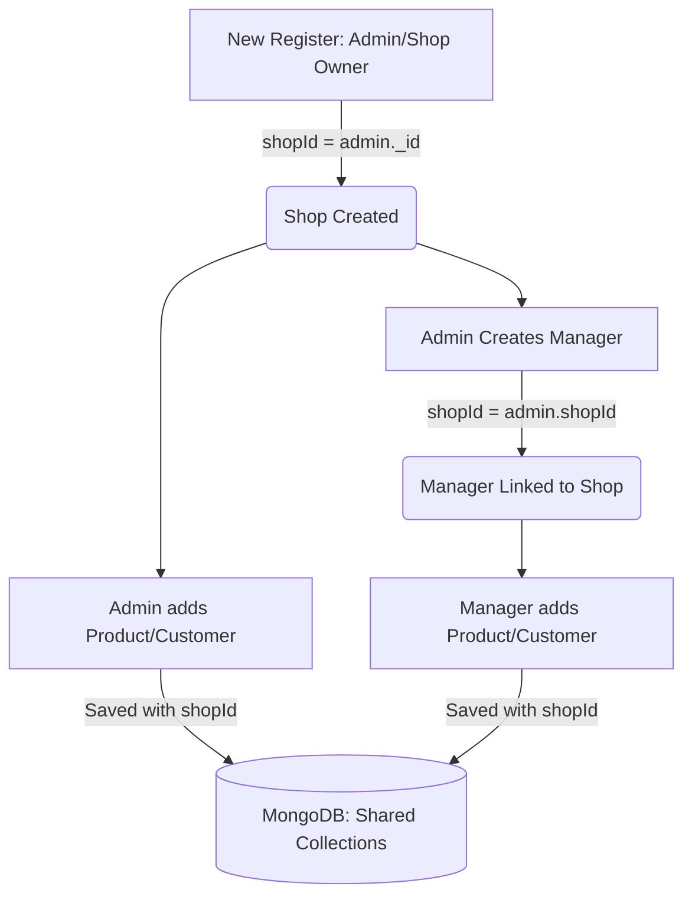
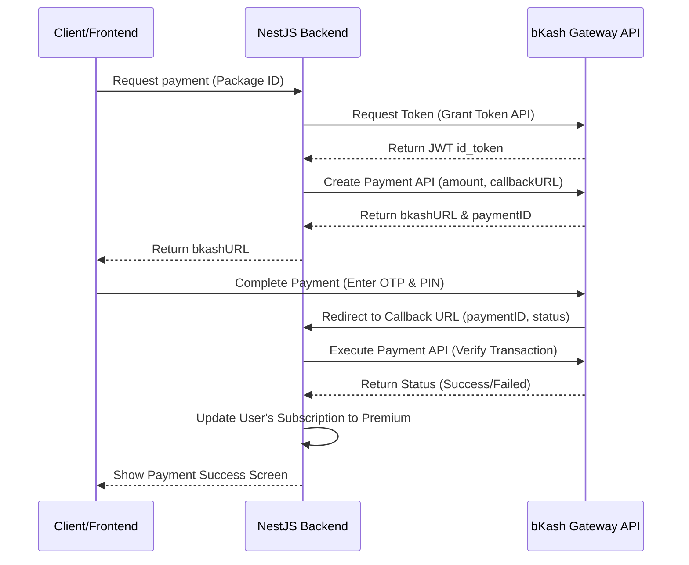

# API Rate Limiting, Manual Payment, and bKash Integration Guide

এই গাইডটিতে আপনার **Keeper POS (NestJS + MongoDB)** প্রজেক্টে **API Rate Limiting**, **Super Admin ও Role-based Approval System**, **Subscription Packages**, এবং **Free Tier Limitations** (১টি কাস্টমার, ১টি ম্যানেজার, ৫টি ইনভেন্টরি আইটেম ও ৫টি সেলস লিমিট) কীভাবে ধাপে ধাপে কোডসহ ইমপ্লিমেন্ট করবেন তা বিস্তারিত তুলে ধরা হলো।

---

## সূচিপত্র (Table of Contents)
1. [API Rate Limiting (এপিআই রেট লিমিটিং)](#১-api-rate-limiting-এপিআই-রেট-লিমিটিং)
2. [SaaS Role & Multi-Shop Architecture (শপ ও রোল আর্কিটেকচার)](#২-saas-role--multi-shop-architecture-শপ-ও-রোল-আর্কিটেকচার)
3. [Subscription Packages & Monthly/Yearly Logic (প্যাকেজ ও মেয়াদ নির্ধারণ)](#৩-subscription-packages--monthlyyearly-logic-প্যাকেজ-ও-মেয়াদ-নির্ধারণ)
4. [Multi-Tenancy Data Isolation (শপ অনুযায়ী ডেটা আলাদা রাখার লজিক)](#৪-multi-tenancy-data-isolation-শপ-অনুযায়ী-ডেটা-আলাদা-রাখার-লজিক)
5. [bKash Payment Integration (বিকাশ পেমেন্ট ইন্টিগ্রেশন)](#৫-bkash-payment-integration-বিকাশ-পেমেন্ট-ইন্টিগ্রেশন)
6. [Free Tier Feature Limitations (ফ্রি টিয়ার লিমিটেশন লজিক)](#৬-free-tier-feature-limitations-ফ্রি-টিয়ার-লিমিটেশন-লজিক)

---

## ১. API Rate Limiting (এপিআই রেট লিমিটিং)

এপিআই সিকিউরিটি এবং ডস (DoS) অ্যাটাক প্রতিরোধের জন্য রেট লিমিট অ্যাড করা প্রয়োজন।

### ধাপ ১: প্যাকেজ ইনস্টল
```bash
npm i --save @nestjs/throttler
```

### ধাপ ২: গ্লোবাল কনফিগারেশন (`src/app.module.ts`)
```typescript
import { Module } from '@nestjs/common';
import { ThrottlerModule, ThrottlerGuard } from '@nestjs/throttler';
import { APP_GUARD } from '@nestjs/core';
// ... অন্যান্য imports

@Module({
  imports: [
    // ... অন্যান্য modules
    ThrottlerModule.forRoot([{
      ttl: 60000, // ১ মিনিট
      limit: 20,  // প্রতি মিনিটে সর্বোচ্চ ২০টি রিকোয়েস্ট (আপনার পছন্দমতো পরিবর্তন করতে পারেন)
    }]),
  ],
  providers: [
    {
      provide: APP_GUARD,
      useClass: ThrottlerGuard,
    },
  ],
})
export class AppModule {}
```

---

## ২. SaaS Role & Multi-Shop Architecture (শপ ও রোল আর্কিটেকচার)

আপনার প্রস্তাবিত আর্কিটেকচার অনুযায়ী প্ল্যাটফর্মের রোল এবং শপ স্ট্রাকচার অত্যন্ত সহজ ও সুরক্ষিত উপায়ে ডিজাইন করা হলো:

### রোল এবং শপ রিলেশন:
1. **Super Admin (প্ল্যাটফর্মের মালিক):** পুরো সিস্টেমে মাত্র ১টি অ্যাকাউন্ট থাকবে (যা সিড স্ক্রিপ্ট বা সরাসরি ডাটাবেজ দিয়ে তৈরি হবে)। তিনি কোনো শপের কেনাবেচা বা প্রোডাক্ট দেখতে পারবেন না; তার কাজ হলো শুধু সব শপের অ্যাডমিনদের পেমেন্ট রিকোয়েস্ট ট্র্যাক করা এবং সাবস্ক্রিপশন Approve/Reject করা।
2. **Admin (শপ ওনার):** রেজিস্ট্রেশন পেজ থেকে নতুন শপ ওনার সাইন-আপ করবেন। সাইন-আপ করার সাথে সাথে তার নামে একটি ইউনিক শপ আইডি (`shopId`) তৈরি হবে। প্রতিটি অ্যাডমিন এক একটি ভিন্ন শপের মালিক।
3. **Manager (শপের কর্মী):** অ্যাডমিন তার নিজের ড্যাশবোর্ড থেকে ম্যানেজার তৈরি করবেন। ম্যানেজারটি তৈরি হবে ওই অ্যাডমিনের শপ আইডির (`shopId`) অধীনে।

### User Schema আপডেট (`src/modules/auth/schemas/user.schema.ts`)
রোল ও শপ রিলেশন ট্র্যাক করার জন্য ইউজার মডেলে এই পরিবর্তনগুলো আনতে হবে:

```typescript
// src/modules/auth/schemas/user.schema.ts
@Prop({ required: true, enum: ['superadmin', 'admin', 'manager'], default: 'admin' })
role: string;

@Prop({ required: true, enum: ['free', 'basic', 'premium'], default: 'free' })
subscriptionTier: string;

@Prop({ type: Date, default: null })
subscriptionExpiresAt: Date;

// প্রতিটি ব্যবহারকারী কোন শপের অধীনে তা নির্ধারণের জন্য
@Prop({ type: String, default: null })
shopId: string; // Admin-এর ক্ষেত্রে তার নিজের _id হবে shopId, আর Manager-এর ক্ষেত্রে তার ক্রিয়েটকারী Admin-এর _id হবে shopId
```

---

## ৩. Subscription Packages & Monthly/Yearly Logic (প্যাকেজ ও মেয়াদ নির্ধারণ)

যখন কোনো শপের অ্যাডমিন সাবস্ক্রিপশন ফি পেমেন্ট করবেন, তখন তিনি Monthly নাকি Yearly প্যাকেজ নিচ্ছেন তার ওপর ভিত্তি করে মেয়াদ হিসাব করা হবে।

### ক. প্যাকেজের তালিকা এপিআই:
```typescript
@Get('packages')
getPackages() {
  return [
    {
      id: 'free',
      name: 'Free Starter',
      price: 0,
      limits: { customers: 1, managers: 1, items: 5, sales: 5 },
      durationDays: 0 // আজীবন কিন্তু লিমিটেড
    },
    {
      id: 'premium_monthly',
      name: 'Premium Monthly',
      price: 1000, // BDT
      durationDays: 30
    },
    {
      id: 'premium_yearly',
      name: 'Premium Yearly',
      price: 10000, // BDT (ডিসকাউন্টসহ)
      durationDays: 365
    }
  ];
}
```

### খ. পেমেন্ট এপ্রুভাল ও মেয়াদ ক্যালকুলেশন লজিক:
সুপার অ্যাডমিন যখন পেমেন্ট এপ্রুভ করবেন, তখন `packageId` দেখে মেয়াদ নির্ধারণ হবে:

```typescript
// src/modules/subscriptions/subscriptions.service.ts
async approvePayment(paymentId: string) {
  const payment = await this.subscriptionPaymentModel.findById(paymentId);
  if (!payment || payment.status !== 'pending') {
    throw new BadRequestException('Invalid or already processed payment');
  }

  // পেমেন্ট রিকোয়েস্টকারী অ্যাডমিন (Shop Owner) ইউজারকে খুঁজুন
  const user = await this.userModel.findById(payment.userId);
  if (!user) throw new NotFoundException('Shop owner not found');

  // প্যাকেজ অনুযায়ী দিন হিসাব করুন
  let addedDays = 30; // default monthly
  if (payment.packageId === 'premium_yearly') {
    addedDays = 365;
  }

  // বর্তমান মেয়াদের সাথে নতুন মেয়াদ যোগ করার লজিক (Expiration Calculation)
  let currentExpiry = new Date();
  if (user.subscriptionExpiresAt && new Date(user.subscriptionExpiresAt) > new Date()) {
    currentExpiry = new Date(user.subscriptionExpiresAt); // আগে থেকেই মেয়াদ থাকলে সেটির পর থেকে যোগ হবে
  }
  
  const newExpiry = new Date(currentExpiry.getTime() + addedDays * 24 * 60 * 60 * 1000);

  // ইউজারের সাবস্ক্রিপশন আপডেট
  user.subscriptionTier = 'premium';
  user.subscriptionExpiresAt = newExpiry;
  await user.save();

  // পেমেন্ট স্ট্যাটাস আপডেট
  payment.status = 'approved';
  await payment.save();

  return { message: 'Subscription approved successfully', expiresAt: newExpiry };
}
```

---

## ৪. Multi-Tenancy Data Isolation (শপ অনুযায়ী ডেটা আলাদা রাখার লজিক)

শেয়ার্ড ডাটাবেজ ব্যবহার করে প্রজেক্ট ব্রেক না করে কীভাবে শপ এবং ম্যানেজার অনুযায়ী ডেটা সম্পূর্ণ আলাদা রাখবেন তা নিচে ব্যাখ্যা করা হলো:

### শপ ও ম্যানেজার রেজিস্ট্রেশন ফ্লো (Shop & Manager Isolation Flow)



#### ধাপ ১: Admin রেজিস্ট্রেশন (`src/modules/auth/auth.service.ts`-এ `register` ফাংশনে পরিবর্তন)
যখন কোনো ব্যবহারকারী অ্যাডমিন হিসেবে সাইন-আপ করবেন, তার ইউজার আইডটাই হবে তার দোকানের `shopId`:

```typescript
// auth.service.ts -> register()
const newUser = new this.userModel({
  name: registerDto.name,
  email,
  passwordHash,
  role: 'admin', // ডিফল্ট অ্যাডমিন (Shop Owner)
  subscriptionTier: 'free',
  // shopId-তে ইউজারের নিজের আইডি জেনারেট করে বসিয়ে দিন
  shopId: null, // নিচে এটি সেভ করার পর আপডেট করব
});

const savedUser = await newUser.save();
savedUser.shopId = savedUser._id.toString(); // শপ আইডি এবং ইউজার আইডি সেম
await savedUser.save();
```

#### ধাপ ২: Manager তৈরি করা (`src/modules/auth/auth.service.ts`-এ `createUser` বা ম্যানেজার এন্ট্রি করার সময়)
অ্যাডমিন যখন কোনো ম্যানেজার তৈরি করবেন, তখন ম্যানেজার ইউজারের `shopId` হবে ওই অ্যাডমিনের নিজের `shopId`:

```typescript
// auth.service.ts -> createUser() (ম্যানেজার তৈরির সময়)
async createUser(createUserDto: CreateUserDto, loggedInAdmin: any) {
  // নিশ্চিত করুন ক্রিয়েটকারী ব্যক্তি একজন অ্যাডমিন
  if (loggedInAdmin.role !== 'admin') {
    throw new ForbiddenException('Only Shop Admins can create managers');
  }

  const manager = new this.userModel({
    name: createUserDto.name,
    email: createUserDto.email,
    passwordHash: await bcrypt.hash(createUserDto.password, 10),
    role: 'manager',
    // ম্যানেজারকে অ্যাডমিনের শপ আইডির সাথে লিংক করা হলো
    shopId: loggedInAdmin.shopId, 
  });
  return await manager.save();
}
```

#### ধাপ ৩: প্রোডাক্ট, কাস্টমার এবং সেলস তৈরি ও কুয়েরি করার সময় ফিল্টারিং
যেকোনো আইটেম বা কাস্টমার তৈরি বা খোঁজার সময় রিকোয়েস্টে আসা ব্যবহারকারীর `shopId` ব্যবহার করতে হবে:

##### স্কিমাগুলোতে `shopId` ফিল্ড যুক্ত করুন:
```typescript
// কাস্টমার, আইটেম ও সেলস স্কিমায় এটি যুক্ত হবে:
@Prop({ required: true, type: String })
shopId: string;
```

##### প্রোডাক্ট বা কাস্টমার কুয়েরি করার লজিক (Service File):
```typescript
// src/modules/inventory/inventory.service.ts
async findAllItems(user: any, category?: string) {
  // ইউজার অ্যাডমিন বা ম্যানেজার যাই হোক না কেন, তার প্রোফাইলে থাকা shopId কুয়েরি ফিল্টারে যাবে
  const query: any = { shopId: user.shopId };
  if (category) query.category = category;
  
  const items = await this.itemModel.find(query).exec();
  return items.map(item => this.formatItem(item, user));
}
```

##### ডেটা সেভ করার লজিক (Service File):
```typescript
// src/modules/inventory/inventory.service.ts
async createItem(createItemDto: CreateItemDto, user: any) {
  const item = new this.itemModel({
    ...createItemDto,
    shopId: user.shopId, // রিকোয়েস্ট পাঠানো ইউজারের shopId অটোমেটিক্যালি সেভ হবে
  });
  return await item.save();
}
```

---

## ৫. bKash Payment Integration (বিকাশ পেমেন্ট ইন্টিগ্রেশন)

### পদ্ধতি ১: ম্যানুয়াল বিকাশ
- গ্রাহক ফ্রন্টএন্ডে আপনার বিকাশ পার্সোনাল নাম্বার দেখতে পাবেন।
- গ্রাহক টাকা পাঠিয়ে ট্রানজেকশন আইডি (TrxID) ইনপুট দেবেন।
- অ্যাডমিন প্যানেল থেকে `superadmin` এসএমএস দেখে এটি এপ্রুভ করবেন।

### পদ্ধতি ২: অটোমেটেড বিকাশ গেটওয়ে (bKash PGW API)
বিকাশের মার্চেন্ট পোর্টাল থেকে প্রাপ্ত `App Key`, `App Secret`, `Username`, `Password` নিয়ে এপিআই কল করার ফ্লো:



---

## ⑥. Free Tier Feature Limitations (ফ্রি টিয়ার লিমিটেশন লজিক)

ফ্রি টিয়ারে থাকা অবস্থায় গ্রাহকদের ওপর লিমিটেশন (১ কাস্টমার, ১ ম্যানেজার, ৫ প্রোডাক্ট, ৫ সেল) প্রয়োগ করতে প্রতিটি মডিউলের সার্ভিস ফাইলে ক্রিয়েট করার পূর্বে একটি **Validation Check** বসাতে হবে।

### ১. গ্রাহক সীমা (Max 1 Customer Limit)
```typescript
// src/modules/customers/customers.service.ts
async createCustomer(createCustomerDto: CreateCustomerDto, user: any) {
  const customerCount = await this.customerModel.countDocuments({ shopId: user.shopId });
  const currentUser = await this.userModel.findById(user.uid || user.id);
  
  if (currentUser.subscriptionTier === 'free' && customerCount >= 1) {
    throw new BadRequestException(
      'Free tier is limited to 1 customer only. Please upgrade to premium.'
    );
  }

  const customer = new this.customerModel({ ...createCustomerDto, shopId: user.shopId });
  return await customer.save();
}
```

### ২. ম্যানেজার সীমা (Max 1 Manager Limit)
```typescript
// src/modules/auth/auth.service.ts
async createUser(createUserDto: CreateUserDto, creatorUser: any) {
  if (createUserDto.role === 'manager') {
    const managerCount = await this.userModel.countDocuments({ role: 'manager', shopId: creatorUser.shopId });
    const creator = await this.userModel.findById(creatorUser.uid || creatorUser.id);

    if (creator.subscriptionTier === 'free' && managerCount >= 1) {
      throw new BadRequestException(
        'Free tier is limited to 1 manager account only. Please upgrade to premium.'
      );
    }
  }
}
```

### ৩. প্রোডাক্ট সীমা (Max 5 Inventory Items Limit)
```typescript
// src/modules/inventory/inventory.service.ts
async createItem(createItemDto: CreateItemDto, user: any) {
  const itemCount = await this.itemModel.countDocuments({ shopId: user.shopId });
  const currentUser = await this.userModel.findById(user.uid || user.id);

  if (currentUser.subscriptionTier === 'free' && itemCount >= 5) {
    throw new BadRequestException(
      'Free tier is limited to 5 inventory items only. Please upgrade to premium.'
    );
  }
}
```

### ৪. সেলস সীমা (Max 5 Sales Limit)
```typescript
// src/modules/sales/sales.service.ts
async createSale(createSaleDto: CreateSaleDto, user: any) {
  const saleCount = await this.saleModel.countDocuments({ shopId: user.shopId });
  const currentUser = await this.userModel.findById(user.uid || user.id);

  if (currentUser.subscriptionTier === 'free' && saleCount >= 5) {
    throw new BadRequestException(
      'Free tier is limited to 5 sales transactions only. Please upgrade to premium.'
    );
  }
}
```
